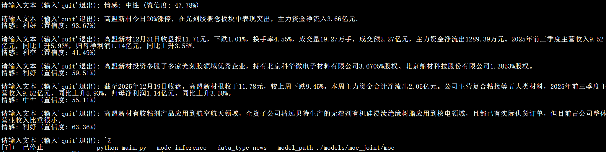

English | [简体中文](./README_CN.md)
# FinSA-MoE：A Parameter-Efficient Mixture-of-Experts Framework for Cross-Domain Chinese Financial Sentiment Analysis

## Overall Framework
FinSA-MoE (Financial Sentiment Analysis–Mixture-of-Experts) is a parameter-efficient Mixture-of-Experts framework designed for cross-domain Chinese financial sentiment analysis, as shown in Figure 1. The framework constructs domain experts for financial news and stock forum comments by applying LoRA fine-tuning to the GLM-Z1-9B model, and introduces a Mixture-of-Experts (MoE) architecture to adaptively select experts, enabling efficient generalization across domains.Meanwhile, we construct the FinNF dataset, which contains 1.66 million high-quality Chinese financial news and stock forum texts annotated with sentiment polarity, providing a solid data foundation for fine-tuning and evaluation of the FinSA-MoE framework. Experimental results demonstrate that FinSA-MoE significantly outperforms traditional deep learning models and existing financial large language models in terms of accuracy, precision, recall, and F1-score, and exhibits stronger robustness and generalization capability on high-noise and semantically ambiguous texts.
<p align="center">
  
</p>
<p align="center">
  Figure 1  Overall architecture of FinSA-MoE
</p>


## Dataset Description
The **FinNF dataset** used in this work has been publicly released. Please place the downloaded and extracted data files in the following directory:
```text
FinSA-MoE/data
```
*If you want to train experts for other domains, you can fine-tune the model using other relevant datasets. The dataset fields should include id, text, and label.*
### Download Links
The FinNF dataset can be downloaded from the following sources:<br>
👉 [Google Drive](https://drive.google.com/drive/folders/1NqjRtXBjntKkiNlxBkvgnzRnrbw4M0PY?usp=sharing)<br>
👉 [Baidu Netdisk](https://pan.baidu.com/s/1P7tps9G-8rcEBrslOTyXtQ?pwd=8888)|Extraction code：8888<br>

### 📊 Dataset Statistics 📊
We split the news dataset and the stock forum dataset using ratios of 98%/1%/1% and 60%/20%/20%, respectively. The sentiment polarity distribution of the FinNF dataset is shown in Figure 2.
<p align="center">
  
</p>
<p align="center">
  Figure 2  Sentiment polarity distribution of the FinNF dataset
</p>

## Environment Requirements
Python version：>=3.11

Download the project code via Git：
```bash
git clone https://github.com/chtkg/FinSA-MoE.git
cd FinSA-MoE
```
Configure the environment using the following commands:
```bash
conda create -n myenv python=3.11 -y   # myenv is the name of the virtual environment
conda activate myenv      # activate the virtual environment
pip install -r requirements.txt   # install dependencies
```
## Single-Expert Fine-Tuning
Run the following command:
```bash
python scripts/train_news_expert.py    # you can also use train_forum_expert.py; the two files are identical
```
This will generate a LoRA fine-tuned model. After fine-tuning FinSA-MoE on the FinNF news and forum datasets, the performance on the test sets is shown in Figures 3 and 4, respectively.
<p align="center">
  
</p>
<p align="center">
  Figure 3  Performance of FinSA-MoE vs. baselines on the FinNF news test set
</p>
<p align="center">
  
</p>
<p align="center">
  Figure 4  Performance of FinSA-MoE vs. baselines on the FinNF forum test set
</p>

## MoE Joint Training
First, merge the sub-models fine-tuned with LoRA by running the following command:
```bash
python scripts/merge_expert_lora.py    # 会生成MoE初始模型
```
A router is introduced to enable the FinSA-MoE framework to automatically select appropriate experts. We mix the training, validation, and test sets of the news and forum datasets for joint training, and use domain labels as supervision signals (dataset field: domain).
During the first 500 steps, all parameters of the news and forum experts from the single-expert fine-tuning stage are frozen, and only the router and classification head are trained. Subsequently, all expert LoRA parameters are unfrozen and jointly trained with the router. The router parameters and the two LoRA expert parameters are updated together via backpropagation. <br>
After generating the moe_init model file, run the following command:
```bash
python scripts/train_joint_moe.py   # generates the model trained only with router and classification head: router_warmup; and the final model: moe_joint
```

## Evaluation and Inference
Run the following command to evaluate model performance:
```bash
python scripts/evaluate.py --model_path model_path --dataset_type news --data_path dataset_path
```
nference can be performed using FinSA-MoE/main.py or FinSA-MoE/src/inference.py:
```bash
python main.py --mode inference --data_type forum --model_path model_path
python src/inference.py
```
<p align="center">
  
</p>
<p align="center">
  Figure 5 Inference
</p

