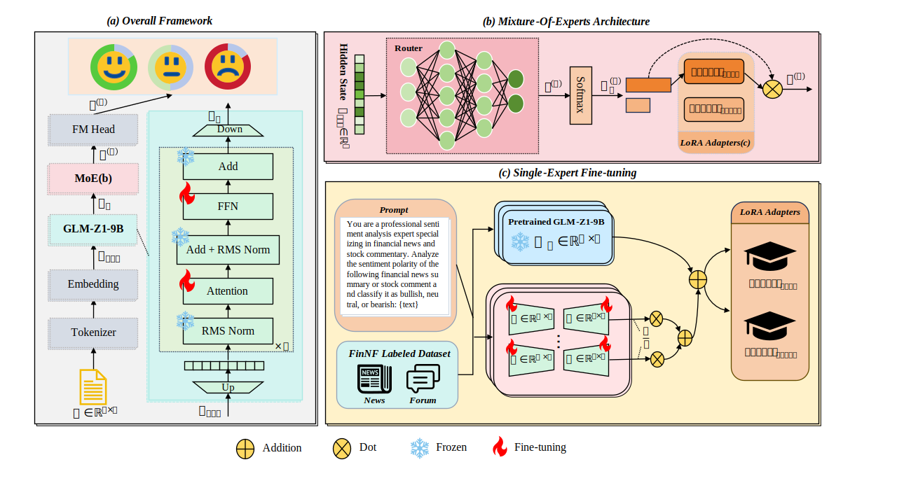
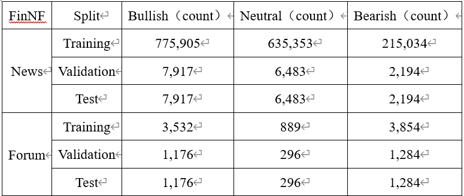

[English](./README.md) | 简体中文
# FinSA-MoE：面向跨领域中文金融情绪识别的参数高效混合专家框架

## 整体框架
FinSA-MoE（Financial Sentiment Analysis-Mixture-of-Experts），一种面向跨领域中文金融情绪识别的参数高效混合专家框架，如图1所示。该框架通过对GLM-Z1-9B模型的LoRA微调，构建了面向金融新闻与股票评论的领域专家，并引入Mixture-of-Experts(MoE)架构以自适应选择专家，实现跨领域情绪识别的高效泛化。同时，我们构建了FinNF数据集，包含166万条带情感极性的高质量中文金融新闻与股评文本，为FinSA-MoE框架的微调与评测提供了数据基础。实验结果表明，FinSA-MoE在准确率、精确率、召回率及F1值等指标上均显著优于传统深度学习模型与现有金融大语言模型，在高噪声、语义模糊的文本中表现出更强的稳健性与泛化能力。
<p align="center">
  
</p>
<p align="center">
  图 1  FinSA-MoE 整体框架
</p>


## 数据集说明
本文所使用的 **FinNF 数据集** 已开源。请将下载并解压后的数据文件放置于以下目录中：
```text
FinSA-MoE/data
```
### 下载方式
FinNF 数据集可通过以下途径下载：<br>
👉 [Google Drive](https://drive.google.com/drive/folders/1NqjRtXBjntKkiNlxBkvgnzRnrbw4M0PY?usp=sharing)<br>
👉 [百度网盘](https://pan.baidu.com/s/1P7tps9G-8rcEBrslOTyXtQ?pwd=8888)|提取码：8888<br>

### 📊 数据集统计📊
我们分别对新闻和股评数据集采用98%/1%/1%与60%/20%/20% 的划分比例。FinNF 数据集的情绪极性分布见图2：
<p align="center">
  
</p>
<p align="center">
  图 2  FinNF数据集情绪极性分布
</p>

## 环境要求
python版本：>=3.11

通过git将项目代码下载到本地：
```python
git clone 
```
依次使用下面语句进行环境配置：
```python
conda create -n myenv python=3.11 -y   # myenv为新建的虚拟环境名称
conda activate 
```


