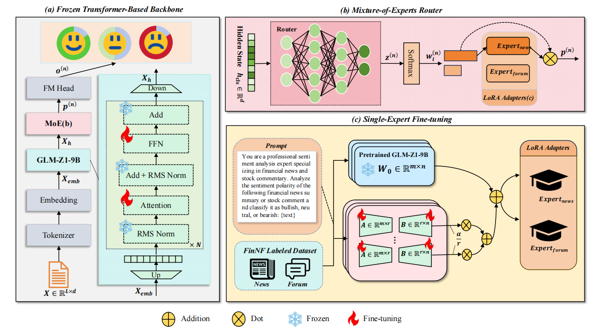

[English](./README.md) | 简体中文
# **FinSA-MoE：一种用于跨领域中文金融情感分析的参数高效混合专家框架——面向领域异质性的金融情感分析自适应专家专门化方法**


## 整体框架
FinSA-MoE（金融情感分析混合专家模型）是一种参数高效的自适应专家专门化框架，旨在解决领域异质性条件下的金融情感分析问题（见图1）。该框架通过 LoRA 微调，引入分别面向金融新闻和股票评论的领域专用专家，并结合 Mixture-of-Experts（MoE）架构，将输入动态路由至最相关的专家，从而提升在异构金融文本来源中的跨领域泛化能力。
此外，我们还提出了 FinNF 数据集，其中包含 166 万篇高质量的金融新闻与股票评论文本，并标注了情感极性，为评估 FinSA-MoE 框架提供了一个全面的基准。实验结果表明，FinSA-MoE 在准确率（Accuracy）、精确率（Precision）、召回率（Recall）和 F1 值等多项评估指标上均优于传统深度学习模型和现有金融大语言模型（LLMs），并在高噪声、语义模糊的环境下展现出良好的鲁棒性和跨领域泛化能力。 


</p>
<p align="center">
图1：所提出的 FinSA-MoE 框架的整体架构
</p>


## 数据集说明
本文所使用的 **FinNF 数据集** 已开源。请将下载并解压后的数据文件放置于以下目录中：
```text
FinSA-MoE/data
```
*如果想训练其他领域的专家，可以使用其他相关数据集进行微调，字段要保证有id,text,label*
### 下载方式
FinNF 数据集可通过以下途径下载：<br>
👉 [Google Drive](https://drive.google.com/drive/folders/1NqjRtXBjntKkiNlxBkvgnzRnrbw4M0PY?usp=sharing)<br>
👉 [百度网盘](https://pan.baidu.com/s/1P7tps9G-8rcEBrslOTyXtQ?pwd=8888)|提取码：8888<br>

### 📊 数据集统计📊
我们分别对新闻和股评数据集采用98%/1%/1%与60%/20%/20% 的划分比例。FinNF 数据集的情绪极性分布见图2：
<p align="center">
  
</p>
<p align="center">
  图 2  FinNF数据集情绪极性分布
</p>

## 环境要求
python版本：>=3.11

通过git将项目代码下载到本地：
```bash
git clone https://github.com/chtkg/FinSA-MoE.git
cd FinSA-MoE
```
依次使用下面语句进行环境配置：
```bash
conda create -n myenv python=3.11 -y   # myenv为新建的虚拟环境名称
conda activate myenv      # 激活虚拟环境
pip install -r requirements.txt   # 安装库
```
## 单专家微调
运行如下代码:
```bash
python scripts/train_news_expert.py    # 也可以使用train_forum_expert.py，这两个文件一样
```
会生成LoRA微调后的模型。

## MoE联合训练
首先合并经过LoRA微调后的几个子模型，运行如下代码：
```bash
python scripts/merge_expert_lora.py    # 会生成MoE初始模型
```
引入一个路由器，使FinSA-MoE框架具备“自动选择合适专家”的能力，我们将新闻和股评数据的训练集、验证集、测试集混合用于联合训练，并使用领域标签作为监督信号（数据集字段：domain）。前500 steps，我们先冻结单专家微调阶段的新闻专家和股评专家的全部参数，仅训练Router和分类头，随后解冻所有专家 LoRA 参数与路由器联合训练，路由器参数和两个 LoRA 专家参数共同接受梯度更新。<br>
生成moe_init模型文件后，运行如下代码:
```bash
python scripts/train_joint_moe.py   # 会生成仅训练Router和分类头的模型：router_warmup；和最终模型：moe_joint
```

## 评估和推理
运行如下代码评估模型性能：
```bash
python scripts/evaluate.py --model_path 模型路径 --dataset_type news --data_path 数据集路径
```
使用FinSA-MoE/main.py可以进行推理，也可以使用FinSA-MoE/src/inference.py进行推理
```bash
python main.py --mode inference --data_type forum --model_path 模型路径
python src/inference.py
```
<p align="center">
  
</p>
<p align="center">
  图 3 推理
</p>


